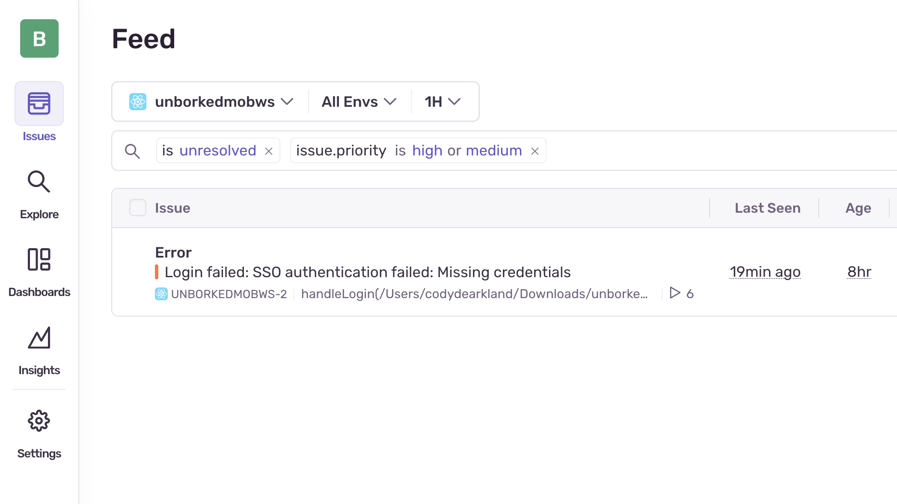
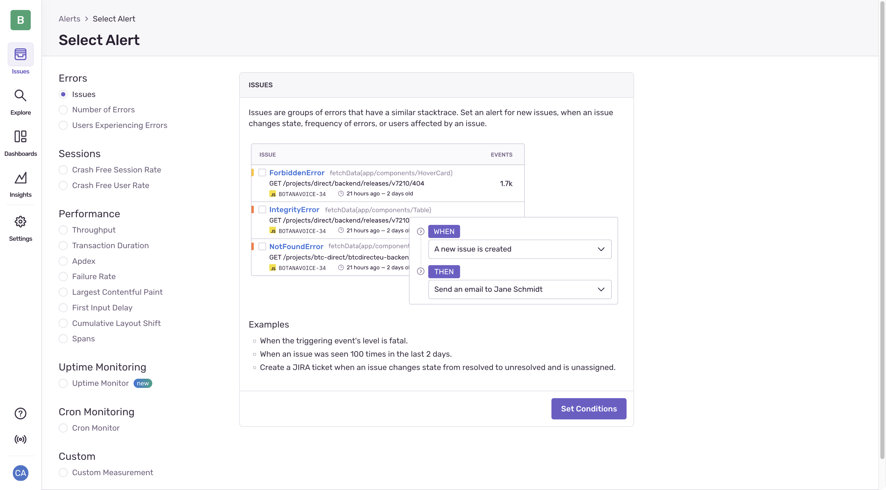
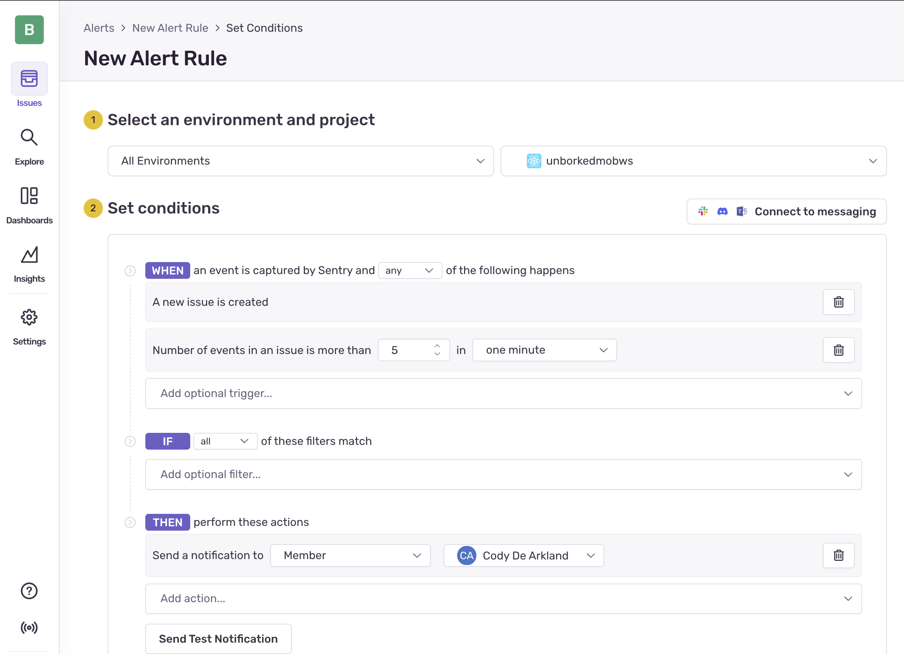

import { Steps } from '@astrojs/starlight/components';

Sentry's installed, and we've captured our first error! Great! But... this could get noisy real fast. Sentry gives us a ton of different options around tuning the way alerts are received so we can focus on th ones that matter.

## Tuning Alerts

Picture this: You grab your phone to doomscroll and decide you're going to do something more productive. You jump into Unborked to buy yourself some farm to fork hand crafted error fixes, and you can't even sign in. This is the night,are you live in RIGHT NOW.

Single sign on? More like single sign not... ok, that was corny. I get it. But either way, single sign on is hosed, and we need to fix it, but first, we need to make sure that we're setting up better alerts for when things go wrong.

## Alerting in Sentry

Something Sentry is strongest at is creating issues that are actionable, meaning you're getting the right amount of context at the right time to go solve the problem. The problem is... sometimes alerts are noisy, and if you don't adjust them - you might end up in a siutation where you're ignoring more than you're taking action on. 

Sentry has a lot to offer when it comes to ways to configure custom alert behavior.

## Cleaning up our alerts 

If you examine the default rule that configured for your Sentry project it's pretty basic. For issues that are high priority, its set to "Suggested Assignees" a notification. In many cases this might be fine; but if you have an environment where you expect occasional issues, it can get noisy quickly. Lets configure an alert for when it exceeds 5 events in a minute - a volume that might suggest that the issue is happening much more frequently.

<Steps>

  1. Access the alerts screen in your Unborked mobile project 

     - Highlight issues on the left navigation screen, and select "Alerts"

  2. Delete the default alert thats been configured 

     Select the 3 dots on the right hand side and delete the default alert. Ensure you confirm the deletion. 

  3. Create a new alert 

     Select the "Create Alert" button in the top right corner. Select "Issues" for the Alert type.

  4. Configure the alert 

     Configure the filters to setup the alerts based on the following configurations: 
       - Number of events in an issue in an issue is more than (value) in (interval) and set it to 3 in 1 minute (for testing)
       - Send an email to your user

       

  5. Test the alert

     Select the "Send test notification" button to send a 

</Steps>

Alerting is incredibly flexible, explore a few of the other alert types for more details but some useful ones are 

- Alerting based on performance changes 
- Alerting based on tracing or spans 
- Uptime (or downtime) alerts 
- Anamaly detection

Configuring these gives you a lot of options when it comes to getting the right notifications at the right time. 

Now that we've worked through errors - lets get into what really matters, actually debugging our problems using Sentry.

