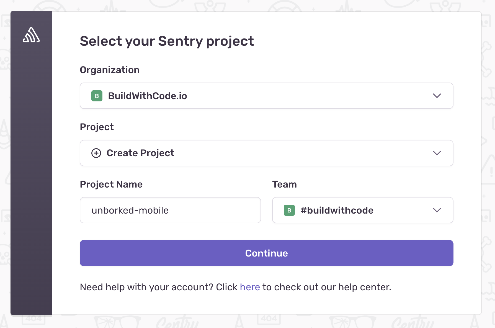
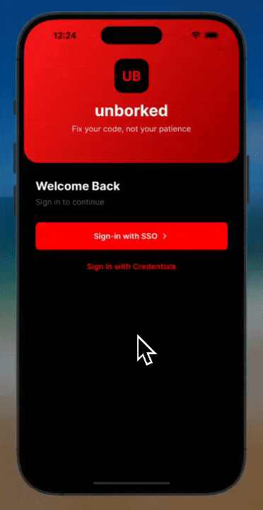

import { Steps } from '@astrojs/starlight/components';

Let's face it—your code is going to break, even when its mobile. The question is: how fast can you fix it when it does? In this section, we'll add Sentry to our Unborked Mobile application so we can catch those errors in the wild before our users start tweeting about them.

## Setting Up Sentry

<Steps>
  1. **Run the Sentry CLI Wizard**

     Get Sentry integrated with our ErrorFix application quickly:

     ```bash
     npx @sentry/wizard@latest -i reactNative
     ```

     This wizard will:
     - Configure the Sentry SDK in React Native 
     - Enable error monitoring, and mobile replays
     - Create your Sentry project if you don't have one yet

  2. **Complete the Authentication Process**

     When you run the command, you'll be prompted to authenticate:

     - Choose between browser login (easiest) or an auth token
     - The wizard will open your browser and let you log in to Sentry

  3. **Select or Create a Project**

     Choose your Sentry project:

     

     - If you don't have one yet, the wizard can create it for you
     - Select "Next.js" as the platform

  4. **Choose Features to Enable**

     You'll be asked which features to enable:

     - **Error Monitoring**: Enable to catch runtime errors
     - **Mobile Replays**: Enable mobile replays
</Steps>


## What Gets Added to Your Project

<Steps>
  1. **Configuration Files the React Native application**

     The wizard adds specific config directives for different parts of the application:

     - `app/_layout.tsx` - Where the Sentry configurations are added to
     - `app.json` - Sentry Expo plugin configurations added 
     - `metro.config.js` - The Sentry expo configurations added 

     Here's what the `app/_layout.tsx` configuration looks like:

     ```javascript
     import * as Sentry from '@sentry/react-native';

      Sentry.init({
         dsn: '<Your Sentry DSN>',

         // Adds more context data to events (IP address, cookies, user, etc.)
         // For more information, visit: https://docs.sentry.io/platforms/react-native/data-management/data-collected/
         sendDefaultPii: true,

         // Configure Session Replay
         replaysSessionSampleRate: 0.1,
         replaysOnErrorSampleRate: 1,
         integrations: [Sentry.mobileReplayIntegration(), Sentry.feedbackIntegration()],

         // uncomment the line below to enable Spotlight (https://spotlightjs.com)
         // spotlight: __DEV__,
      });
     ```

  2. **Update the configuration to enable Tracing and configure Replays**

      We'll need to update the configuration to match the below: 

      ```javascript
         import * as Sentry from '@sentry/react-native';

         Sentry.init({
            dsn: '<Your Sentry DSN>',

            sendDefaultPii: true,

            tracesSampleRate: 1.0,
            replaysSessionSampleRate: 1.0,
            replaysOnErrorSampleRate: 1.0,
            integrations: [Sentry.mobileReplayIntegration(), Sentry.feedbackIntegration()],

         });
         ```
      We're adding 2 properties in, a tracesSampleRate and updating the replaySessionSampleRate to 1.0. These sample rates control how many of the replays or traces that are sent to Sentry are actually kept and used. Setting these high is helpful for debugging, but in production you'll want to set them lower to avoid sending too much data.

  3. **Restart the simulator (sometimes...)**

     Since we've installed singificant packages as part of our setup, we might need to restart the simulator. Cancel it, and run the following command again:

     ```bash
     npx expo run:ios
     ```
</Steps>

## Testing Unborked Mobile

<Steps>
  1. **Test login**

     When the application restarts, you should be able to attempt to login with SSO, which should trigger an error... and now, we're good to go!

     

  2. **Verify in Sentry Dashboard**

     Log in to your Sentry account and check the "Issues" section to see the errors you've triggered. You should see detailed information about the error. If you dive into this error you should see:
     
     - Stack traces
     - Request information
     - Mobile replays

     

</Steps>

## Next Steps

Now that Sentry is configured in your application, you're ready to start the workshop exercises. These will guide you through common scenarios and show you how to use Sentry to diagnose and fix them.

Head to the exercises in [Debugging Issues](/debugging-issues/) section to get unborking.